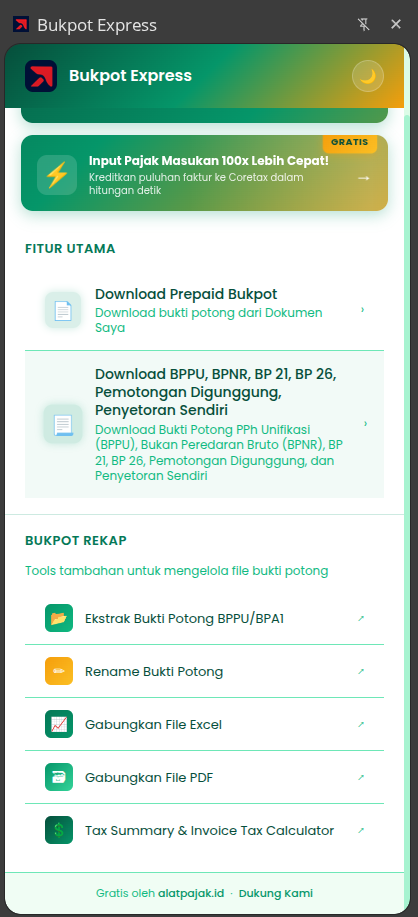
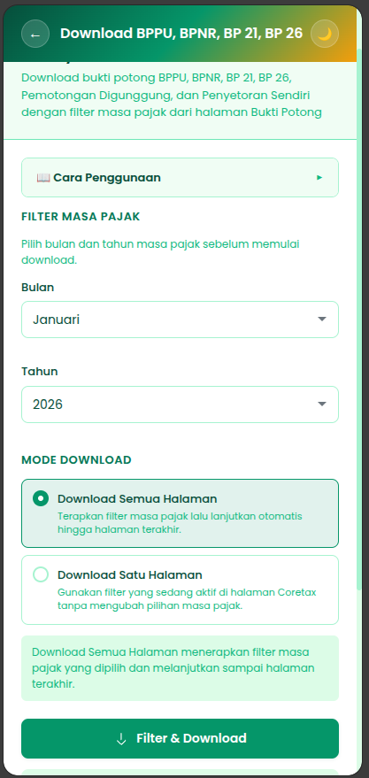

# Bukpot Express

<p align="center">
  
</p>

<p align="center">
  <strong>Automated Tax Document Downloader for CoreTax DJP Portal</strong>
</p>

<p align="center">
  <a href="https://github.com/username/BukpotExpress">
    
  </a>
  <a href="https://chromewebstore.google.com/detail/bukpot-express/kgombpioeclaoecannbilgcjcbpdplnb">
    
  </a>
  <a href="LICENSE">
    
  </a>
  <a href="https://chromewebstore.google.com/detail/bukpot-express/kgombpioeclaoecannbilgcjcbpdplnb">
    
  </a>
</p>

<p align="center">
  <a href="#features">Features</a> •
  <a href="#supported-documents">Supported Documents</a> •
  <a href="#installation">Installation</a> •
  <a href="#usage">Usage</a> •
  <a href="#contributing">Contributing</a>
</p>

---

## Screenshots

<p align="center">
  <strong>Extension Interface</strong><br>
  
</p>

<p align="center">
  <strong>In Action on CoreTax Portal</strong><br>
  
</p>

---

## Supported Documents

The extension supports downloading the following document types from the CoreTax DJP portal:

| Document Type | Description |
|---------------|-------------|
| **BPPU** | Bukti Potong Pajak Penghasilan Unifikasi (Unification Income Tax Withholding Slip) |
| **BP NR** | Bukti Potong Non-Resident (Withholding slip for non-resident taxpayers) |
| **BP 21** | Bukti Potong PPh Pasal 21 (Income Tax Article 21 - employee income) |
| **Prepaid Bukpot** | Prepaid Bukti Potong (Down payment withholding documents) |

---

## Features

- **Batch Download** - Download 1000+ tax documents with a single click
- **Multi-Document Support** - Works with all document types (BPPU, BP NR, BP 21, Prepaid Bukpot)
- **Period Filtering** - Filter by month and year with automatic dropdown selection
- **Multi-Page Support** - Automatically navigate and download from all available pages
- **Real-Time Progress** - Monitor download status with live updates
- **Auto Recovery** - Intelligent error handling with automatic recovery
- **Side Panel Interface** - Non-intrusive UI using Chrome's Side Panel API
- **Stop & Resume** - Reliable stop functionality with accurate progress reporting

---

## Requirements

- Any Chromium-based browser v114+ (Chrome, Edge, Brave, Opera, Vivaldi, Arc, etc.)
- Access to CoreTax DJP portal (Indonesia)

---

## Installation

### Chrome Web Store (Recommended)

Install directly from the [Chrome Web Store](https://chromewebstore.google.com/detail/bukpot-express/kgombpioeclaoecannbilgcjcbpdplnb)

### From Source (Developer Mode)

1. Clone or download this repository
   ```bash
   git clone https://github.com/username/BukpotExpress.git
   ```
2. Open Chrome and navigate to `chrome://extensions/`
3. Enable **Developer mode** (toggle in top-right corner)
4. Click **Load unpacked**
5. Select the `BukpotExpress` folder
6. The extension icon will appear in your Chrome toolbar

---

## Usage

### Quick Start

1. Install the extension from [Chrome Web Store](https://chromewebstore.google.com/detail/bukpot-express/kgombpioeclaoecannbilgcjcbpdplnb)
2. Log in to CoreTax DJP portal
3. Navigate to any Bukti Potong page (BPPU, BP NR, BP 21, or Prepaid Bukpot)
4. Click the Bukpot Express icon in your toolbar
5. Select tax period (month/year) and click **Filter & Download**

### Detailed Steps

1. **Open CoreTax Portal** - Log in to the CoreTax DJP portal and navigate to the Bukti Potong page (e.g., Daftar BPPU, Daftar BP NR, Daftar BP 21, or Prepaid Bukpot)

2. **Open the Extension** - Click the Bukpot Express icon in your Chrome toolbar

3. **Select Tax Period**
   - Choose the month from the dropdown
   - Choose the year from the dropdown

4. **Choose Download Mode**
   - **Single Page** - Download all documents from the current page
   - **Multi-Page** - Download from all available pages automatically

5. **Start Download** - Click the "Filter & Download" button

6. **Monitor Progress** - Watch the status area for real-time updates

7. **Stop Anytime** - Click "STOP Download" to halt the process

All documents will be saved to your default Downloads folder as PDF files with their respective document numbers as filenames.

---

## Project Structure

```
BukpotExpress/
├── manifest.json              # Extension configuration (Manifest V3)
├── popup.html                 # Popup UI
├── popup.css                  # Popup styles
├── popup.js                   # Popup logic
├── sidebar.html               # Sidebar UI
├── sidebar.css                # Sidebar styles
├── background.js              # Background service worker
├── filter_changer.js          # Tax period filter automation
├── collector.js               # Document link collector
├── injector.js                # Progress modal injection
├── downloader.js              # Single-page download coordinator
├── multi_page_downloader.js   # Multi-page download handler
└── images/                    # Extension icons
    ├── icon16.png
    ├── icon48.png
    └── icon128.png
```

---

## Permissions

| Permission | Purpose |
|------------|---------|
| `activeTab` | Access the currently active tab |
| `scripting` | Inject content scripts into pages |
| `sidePanel` | Display the sidebar interface |
| `storage` | Store extension preferences |
| `tabs` | Open promotional links |

### Host Permissions

The extension only operates on CoreTax DJP domains:
- `https://coretax.pajak.go.id/*`
- `https://*.coretax.pajak.go.id/*`
- `https://coretaxdjp.pajak.go.id/*`
- `https://*.coretaxdjp.pajak.go.id/*`

---

## Security & Privacy

- **Local Processing** - All operations happen locally in your browser
- **No Data Collection** - No user data is collected or transmitted to third parties
- **Limited Scope** - The extension only functions on CoreTax DJP portals
- **Open Source** - Full source code is available for review

---

## Browser Compatibility

This extension works on any Chromium-based browser (v114+) since it uses standard Chrome Extension APIs (Manifest V3).

| Browser | Minimum Version | Status |
|---------|-----------------|--------|
| Google Chrome | 114+ | Fully Supported |
| Microsoft Edge | 114+ | Supported |
| Brave | 114+ | Supported |
| Opera | 100+ | Supported |
| Vivaldi | 6.0+ | Supported |
| Arc | Any | Supported |
| Chromium | 114+ | Supported |
| Firefox | - | Not Supported |

---

## Troubleshooting

### Extension Not Responding
1. Go to `chrome://extensions/`
2. Find "Bukpot Express" and click the refresh icon
3. Refresh the CoreTax page and try again

### Filter Not Applied
- Ensure you're on the correct Bukti Potong page
- Verify that the tax period dropdowns are visible on the page
- Refresh the page and restart the process

### Download Stuck or Errors
- Click **STOP** to halt the process
- Refresh the CoreTax page
- Restart the download process

### Debug Logging

Press **F12** to open Developer Tools and check the Console tab. Look for messages prefixed with:
- `BG:` - Background script logs
- `Content script:` - Content script logs
- `Collector:` - Document collection logs
- `Downloader:` - Download process logs

---

## FAQ

<details>
<summary><strong>Is this extension free to use?</strong></summary>
<br>
Yes! Bukpot Express is completely free and open source under the MIT License.
</details>

<details>
<summary><strong>Does this extension collect my data?</strong></summary>
<br>
No. All processing happens locally in your browser. No data is sent to any external servers.
</details>

<details>
<summary><strong>Which tax documents can I download?</strong></summary>
<br>
The extension supports BPPU, BP NR, BP 21, and Prepaid Bukpot documents from the CoreTax DJP portal.
</details>

<details>
<summary><strong>Can I use this on Firefox?</strong></summary>
<br>
No. This extension uses Chrome's Side Panel API which is not available in Firefox. It only works on Chromium-based browsers (Chrome, Edge, Brave, Opera, Vivaldi, Arc).
</details>

<details>
<summary><strong>Where are the downloaded files saved?</strong></summary>
<br>
All documents are saved to your browser's default Downloads folder as PDF files.
</details>

---

## Contributing

Contributions are welcome! Please feel free to submit a Pull Request.

1. Fork the repository
2. Create your feature branch (`git checkout -b feature/amazing-feature`)
3. Commit your changes (`git commit -m 'Add amazing feature'`)
4. Push to the branch (`git push origin feature/amazing-feature`)
5. Open a Pull Request

---

## License

This project is licensed under the MIT License - see the [LICENSE](LICENSE) file for details.

---

<p align="center">
  Made with ❤️ for Indonesian taxpayers
</p>
